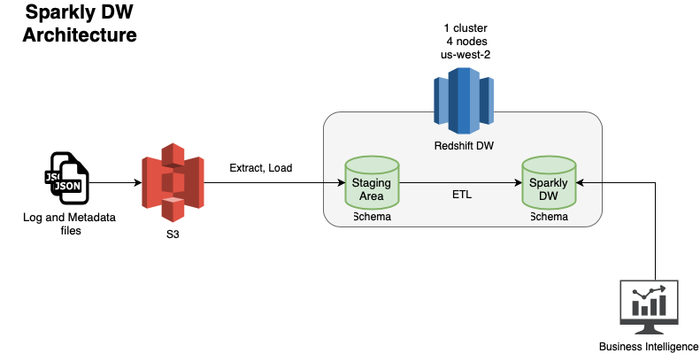

# Project: RedShift Data Warehouse 

# Scenario: Sparkify Streaming Music App

> Note: If you are interested in Data Lakes, we will be using the same data set but instead of a Data Warehouse, we will build a Data Lake on S3, using Spark for ETL. We will leverage AWS EMR. You can check it out [here](https://github.com/tatwan/emr-pyspark)

### Introduction

This project assumes a scenario for a music streaming startup, Sparkify, which has grown their user base and song database and want to move their processes and data onto the cloud. Their data resides in S3, in a directory of many JSON logs on user activity on the app, as well as a directory with many JSON metadata on the songs in their app.

As data engineers, we are tasked with building an ETL pipeline that extracts their data from S3, stages them in Redshift, and transforms data into a set of dimensional tables for their analytics team to continue finding insights in what songs their users are listening to. We will test our database and ETL pipeline by running queries given to us by the analytics team from Sparkify and compare our results with their expected results.

Below is the Dimensional Model for the Sparkify data warehouse.


Below is the overall AWS Cloud Architecture.



### Steps

1. Capture business requirements in regards to the data sources to understand the content of the JSON files, what is important for the business in terms of reporting, to determine how to architect and model the data warehouse.
2. Use Python to perform Data Exploration on the JSON files.
   1. Use Pandas to read and load all the files into DataFrames to perform EDA.
   2. Understand data types, sizes and overall content to gain further understanding on the data quality, data content and what strategy needs to be implemented to build the Data Warehouse.
3. Create a **Staging** Schema to extract data from all the log files and metadata files into a Redshift schema. The staging area has two tables:
   1. `staging_events_table`
   2. `staging_songs_table`
4. Create the DW Dimensional Model DDL (Fact and Dimension Tables)
   1. **1 Fact and 4 Dimension** tables based on requirements 
5. Query optimization
   1. Leverage Redshift optimization best practices
      1. Create all proper constraints (PK and FK)
      2. Implement **distribution strategy:** example using `ALL` strategy for smaller tables, and partition by `key` for larger tables via `DISTTYLE` and `DISTKEY`
      3. Implementing sorting strategy for improved performance on commonly used columns for joining and filtering via `SORTKEY`
6. Load the data 
   1. EL (Extract and Load) from Source (S3) to target staging area
   2. ETL (Extract, Transform, and Load) data from the Staging Area to the final target tables in the Data Warehouse

## How to use the code provided :

* (DEV) **Redshift-DW-Dev.ipynb** is a Jupyter Notebook file for Exploratory Data Analysis  to understand the Data, as well as perform test scripts to create the Schemas and DW Tables
* (PROD) **Create_Tables.py** contains all the necessary script to recreate the schema and tables
* (PROD) **ETL.py** contains all the necessary scripts to load the data from S3 to Staging, and then from Staging to DW tables
* (PROD) **SQL_Queries.py** contains all the SQL scripts that support the two python files above.

To run the code:

1. First run the `create_tables.py` file to create all the necessary backend to support the ETL process

```bash
❯ python create_tables.py

Tables Dropped
Schemas Dropped
Staging_Area and Sparkify Schemas Created
Tables Created

```

2. Then run the `etl.py` file to run all the ETL processes to load Staging and DW tables to make the data available tot he business. 

```bash
❯ python etl.py

Staging Tables Loading Started ...
Loading Complete
DW Tables Loading Started ...
DW Loading Complete
```

3. Finally for testing use the `sample.py` file with a sample query

```bash
❯ python sample.py
First 20 records ....
('Mohammad Rodriguez', 'Shimmy Shimmy Quarter Turn (Take It Back To Square One)', 1, 2018, 15, 'paid', Decimal('193.93261'))
('Tegan Levine', 'Love', 3, 2018, 17, 'paid', Decimal('304.69179'))
('Sara Johnson', "Driver's Seat", 2, 2018, 22, 'paid', Decimal('220.89098'))
('Katherine Gay', 'Fake Tales Of San Francisco', 1, 2018, 5, 'free', Decimal('177.94567'))
('Chloe Cuevas', 'Fake Tales Of San Francisco', 6, 2018, 15, 'paid', Decimal('177.94567'))
('Aleena Kirby', 'Lovefool', 4, 2018, 21, 'paid', Decimal('198.21669'))
('Harper Barrett', 'Lovefool', 1, 2018, 10, 'paid', Decimal('198.21669'))
('Jacqueline Lynch', 'Beautiful', 0, 2018, 19, 'paid', Decimal('285.36117'))
('Mohammad Rodriguez', 'Loneliness', 6, 2018, 5, 'paid', Decimal('471.45751'))
('Lily Koch', 'Planet Caravan (Remastered LP Version)', 3, 2018, 18, 'paid', Decimal('244.50567'))
('Layla Griffin', 'One I Love', 1, 2018, 3, 'paid', Decimal('274.41586'))
('Brantley West', 'Crawling (Album Version)', 2, 2018, 18, 'free', Decimal('208.95302'))
('Tegan Levine', 'Marigold', 3, 2018, 15, 'paid', Decimal('220.34240'))
('Jayden Graves', 'Fool For Your Loving', 0, 2018, 7, 'paid', Decimal('250.35710'))
('Emily Benson', 'Two Is Better Than One', 5, 2018, 16, 'paid', Decimal('242.83383'))
('Jacqueline Lynch', 'Human', 2, 2018, 17, 'paid', Decimal('265.35138'))
('Jacob Klein', "The Train Kept A Rollin'", 1, 2018, 18, 'paid', Decimal('206.10567'))
('Lily Koch', 'Missing (Live in Europe)', 1, 2018, 11, 'paid', Decimal('255.13750'))
('Ava Robinson', "Hey Daddy (Daddy's Home)", 5, 2018, 18, 'free', Decimal('224.10404'))
('Tegan Levine', "Hey Daddy (Daddy's Home)", 4, 2018, 11, 'paid', Decimal('224.10404'))
```


> NOTE: Make suer to provide your own information in `dwh.cfg` file 


### BI Reporting Example (Tableau)


Example Dashboard Analysis 


